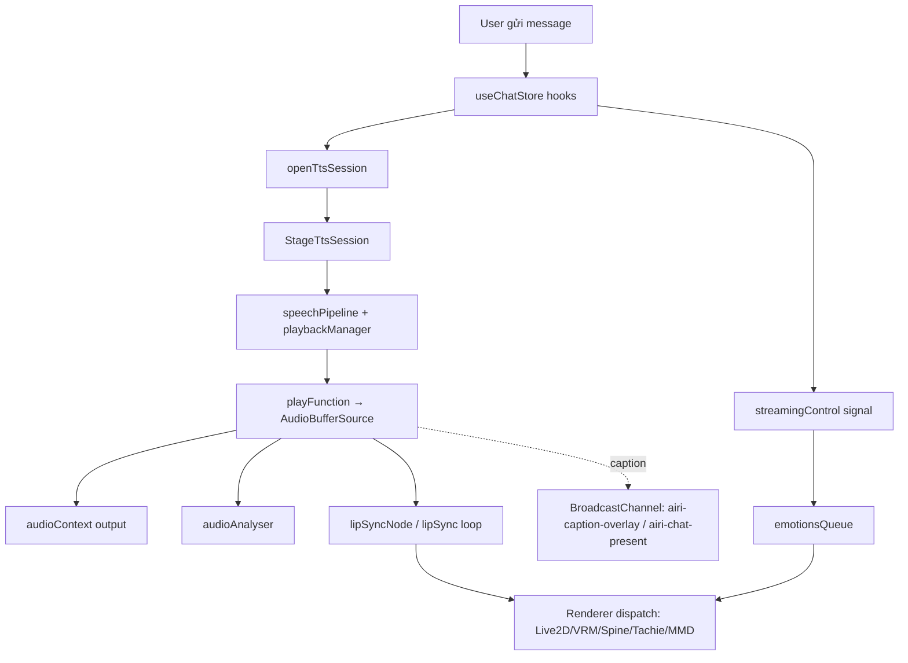

# Phân tích code: Stage.vue + stage-ui-live2d/src/utils

## Giới thiệu

Đây là tài liệu phân tích kiến trúc và chức năng của hai nhóm code chính trong workspace:

1. **`Stage.vue`** — màn hình "sân khấu ảo" (virtual stage) hiển thị nhân vật ảo (VTuber) tương tác với người dùng, kèm toàn bộ pipeline TTS (text-to-speech), lip-sync và cảm xúc.
2. **`stage-ui-live2d/src/utils/`** — bộ tiện ích tải, xác thực, cache và render mô hình Live2D.

Cả hai đều nằm trong monorepo **`dt_rensuri-cv`**, một Laravel + Inertia.js + Vue 3 app, với nhiều package frontend quản lý bằng pnpm + turbo.

---

## Phần 1: `Stage.vue` — Sân khấu VTuber

### 1.1 Vai trò tổng quan

`Stage.vue` đóng vai trò **trung tâm điều khiển (orchestrator)** cho màn hình stage. Nó:

- Chọn và render nhân vật theo **renderer** được cấu hình (Live2D, VRM/Three.js, Spine, Tachie, MMD, hoặc Godot).
- Điều phối toàn bộ luồng **speech**: TTS → audio → lip-sync → biểu cảm → caption.
- Xử lý các **special token** (emotion, motion, delay, plugin call) phát ra từ LLM.
- Lắng nghe các **hook của chat** và phát các hiệu ứng tương ứng.

### 1.2 Các store / state được sử dụng

| Store | Mục đích |
|-------|----------|
| `useSettings()` | Cấu hình chung (renderer, giọng, model selected, theme hue). |
| `useSettingsLive2d()` | Cấu hình riêng Live2D (motion driver, shadow, max FPS, render scale). |
| `useLive2dParams()` | Motion/params hiện tại của mô hình Live2D. |
| `useSpeakingStore()` | Trạng thái `nowSpeaking`, `mouthOpenSize` trong khi nói. |
| `useSpeechStore()` | Provider/model/voice TTS, SSML, pitch. |
| `useSpeechOutputControlStore()` | `latestStopRequest`, `speechMuted`. |
| `useChatStore()` | Hook vòng đời của một turn chat. |
| `useLlmStreamingControlStore()` | Xử lý signal streaming (act / delay / special). |
| `useProviderStore()` / `useProviderConfigStore()` | Registry & config của các provider TTS. |
| `useAiriCardStore()` | Xác định card đang active (owner của speech). |
| `useBackgroundStore()` | Ảnh nền khi capture frame. |
| `useSpeechRuntimeStore()` | Đăng ký host speech pipeline, mở intent. |

### 1.3 Pipeline speech — luồng dữ liệu

```
LLM tokens (chat)
   │
   ▼
chatHookCleanups (onBeforeMessageComposed, onTokenLiteral, ...)
   │
   ├─ onBeforeMessageComposed → hủy session cũ, setup analyzer + lip-sync,
   │                            mở Session TTS mới (openTtsSession)
   ├─ onTokenLiteral  → currentSession.appendText(literal)
   ├─ onTokenSpecial  → currentSession.appendSpecial(special)
   └─ onStreamEnd     → currentSession.finishInput()
            │
            ▼
     StageTtsSession (createStageTtsSession)
            │  • Segmenter adapter (non-streaming)
            │  • WS bidirectional adapter (official streaming provider)
            ▼
     speechPipeline (createSpeechPipeline<AudioBuffer>)
            │   gọi `tts()` (REST) khi cần từng segment
            ▼
     playbackManager (createPlaybackManager<AudioBuffer>)
            │   1 voice, overflowPolicy queue, steal-oldest
            ▼
     playFunction()
            ├─ AudioBufferSourceNode → audioContext.destination
            ├─ → audioAnalyser
            └─ → lipSyncNode (wLipSync graph cho Live2D)
```

#### Điểm quyết định quan trọng

- **`createStageTtsSession` là điểm quyết định duy nhất** về việc dùng streaming hay segmenter. `Stage.vue` KHÔNG branch theo provider id. `resolveSpeechTransport()` đọc thẳng từ registry provider (`capabilities.speech.transport`), nên một provider mới chỉ cần khai báo `transport: 'bidirectional-ws'` là tự chuyển sang streaming.
- **Streaming provider (bidirectional-ws) KHÔNG bao giờ chạm tới `tts()` fallback.** Nếu rơi vào fallback, nó `return null` kèm log warning — tránh lặp lại bug mở lại ws per-segment.
- **Telemetry voice type:** `resolveStageVoiceType()` phân loại `official_selected` vs `custom_configured` trước khi gửi analytics.

### 1.4 Lip-sync Live2D

- `setupLipSync()` tạo `createLive2DLipSync(audioContext, wlipsyncProfile, options)` → trả về `Live2DLipSync` và một `lipSyncNode` trong audio graph.
- `playFunction()` kết nối `source → lipSyncNode` khi renderer là live2d.
- `startLipSyncLoop()` dùng `requestAnimationFrame`, mỗi tick lấy `mouthOpenSize = live2dLipSync.getMouthOpen()` nếu đang nói, ngược lại set 0.
- `resetLive2dLipSync()` dọn dẹp khi chuyển renderer hoặc unmount.

### 1.5 Xử lý emotion / motion (special token)

- `streamingControl.onSignal` nhận signal từ LLM:
  - `type: 'act'` → chuyển `act.motion` / `act.emotion` thành hành động stage (qua `emotionsQueue`).
  - `type: 'delay'` → `sleep(seconds)`.
- `emotionsQueue` (bất đồng bộ, tuần tự) dispatch emotion theo từng renderer:
  - **VRM** → `vrmViewerRef.setExpression(...)`
  - **Live2D** → set `currentMotion.group`
  - **Spine / Tachie / MMD** → `setEmotion(name, intensity)`
- `playSpecialToken()` xử lý special token kể cả khi speech bị mute (không bỏ mất hiệu ứng không phải audio).

### 1.6 VRM tương tác

- `onVRMInteract(target)` — cooldown 450ms, set biểu cảm theo vùng tương tác: `head → happy`, chân → `relaxed`, còn lại → `surprised`.

### 1.7 Streaming session — quản lý vòng đời

- `currentSession` là biến module duy nhất chứa session active.
- `openTtsSession()` tạo session mới; hook `clearIfActive` chỉ clear `currentSession` nếu **chính nó** là session active và `intentId` bắt đầu bằng `stream-` (tránh null nhầm session của người khác, ví dụ read-aloud).
- Watcher theo dõi đổi `provider/voice/model` giữa chừng → `cancel('provider-or-voice-changed')` và null session.
- Watcher `latestStopRequest` → `stopSpeechOutput(reason)`.
- `onUnmounted()` → cancel session, `playbackManager.stopAll`, dispose mọi handler.

### 1.8 Chụp khung hình (capture frame)

- `captureFrame()` chụp khung nhân vật theo renderer, rồi nếu có ảnh nền sẽ **composite** background (cover) + nhân vật lên canvas rồi xuất PNG.

### 1.9 Xuất API qua `defineExpose`

- `{ canvasElement, captureFrame, readRenderTargetRegionAtClientPoint }` — cho component cha sử dụng.

### 1.10 Ghi chú đặc biệt / workaround

- `chatHookCleanups` giữ disposer riêng thay vì gỡ toàn bộ hook toàn cục — để không phá wiring cross-window broadcast.
- `postCaption` / `postPresent` được bọc try-catch vì `BroadcastChannel` có thể đã đóng khi điều hướng trang.
- Block `embed` / DuckDB bị comment lại — đánh dấu "future update" (memory).

---

## Phần 2: `stage-ui-live2d/src/utils/` — Tiện ích Live2D

Package này gồm 8 file. `index.ts` re-export tất cả.

### 2.1 Tổng quan các file

| File | Chức năng |
|------|-----------|
| `decode-zip-filename.ts` | Decode tên file trong zip ở legacy codepage (tránh mojibake cho tên không phải ASCII). |
| `eye-motions.ts` | Sinh interval saccade ngẫu nhiên cho mắt (tự nhiên hơn). |
| `live2d-opfs-registration.ts` | Đăng ký middleware OPFS cache vào `Live2DFactory` (chèn trước/sau `ZipLoader`). |
| `live2d-preview.ts` | Render thử model ra offscreen canvas, crop empty pixels, đệm về tỉ lệ 12:16, trả data URL preview. |
| `live2d-structure-report.ts` | Báo cáo cấu trúc zip mô hình. |
| `live2d-validator.ts` | Xác thực zip mô hình: entry point, MOC header, weight, basename collision. |
| `live2d-zip-loader.ts` | Override `ZipLoader` của pixi-live2d-display (decode tên, lọc rác, trích CDI/EXP metadata, sanitize settings). |
| `opfs-loader.ts` | Lưu/cache mô hình vào **OPFS** (Origin Private File System) để load offline nhanh. |

### 2.2 Chi tiết từng phần

#### `live2d-validator.ts` — Validate ZIP

Trả về `Live2DValidationReport` với:
- **Entry point:** tìm `.model3.json` (standard) hoặc 1 file `.moc3` duy nhất (heuristic / loose files).
- **MOC audit:** kiểm tra header `MOC3`, sub-version, kích thước (cảnh báo nếu >30MB, lỗi "Mega-Model" nếu >100MB do giới hạn WASM).
- **Basename collision audit:** phát hiện các archive có tên cơ sở trùng → điểm yếu của `ZipLoader`.

#### `live2d-zip-loader.ts` — ZipLoader tùy biến

Override 2 method tĩnh của `ZipLoader`:
- `zipReader`: dùng `JSZip.loadAsync` với `decodeZipFileName` (đồng bộ với validator, tránh mâu thuẫn mojibake).
- `createSettings`:
  - Lọc bỏ các segment rác: `__MACOSX`, file bắt đầu `._`.
  - Ưu tiên settings file `*.model3.json`; nếu không có → `createFakeSettings`.
  - Trích **CDI data** (`_cdiData`) và các file **expression** (`_expFiles`) từ zip.
  - `sanitizeModelSettingsText`: bỏ các `FileReferences.Physics/Pose/DisplayInfo === null`.
  - `normalizeLive2DArchivePath`: `decodeURI` các path đã percent-encode về dạng archive thật.

#### `opfs-loader.ts` — Cache sang OPFS

- `OPFSCache` với cache schema version `v3`.
- `readDirectoryRecursive`: đọc toàn bộ thư mục, bỏ qua `__meta.json` và entry rác, gán `webkitRelativePath` cho từng file (đúng kỳ vọng của live2d-display).
- Có `checkMiddleware` (đọc cache trước) và `saveMiddleware` (ghi cache sau) — được lắp vào pipeline `Live2DFactory`.
- `clearAll()`: dọn toàn bộ OPFS root.

#### `live2d-preview.ts` — Tạo ảnh preview

- Dựng PixiJS `Application` offscreen (`preserveDrawingBuffer: true`).
- Tải File → `Live2DFactory.setupLive2DModel`.
- Render, `cropImg` (bỏ empty pixels), rồi **pad về 12:16** và xuất data URL.

#### `eye-motions.ts` — Saccade mắt

- Bảng phân phối tích lũy `EYE_SACCADE_INT_P` + `randomSaccadeInterval()` trả interval (ms) ngẫu nhiên giữa các lần nháy mắt/saccade.

---

## Phần 3: Kiến trúc chung & luồng tương tác



---

## Phần 4: Nhận xét & điểm đáng chú ý

1. **Thiết kế factory-first cho streaming:** rất tốt — Stage không phụ thuộc vào id provider, dễ thêm provider mới.
2. **Phòng bug session leak:** cơ chế `clearIfActive` so sánh identity (không phải tên) — xử lý đúng nhiều session cùng lúc.
3. **Chống mojibake nhất quán:** cùng một `decodeZipFileName` được dùng cả validator lẫn ZipLoader - đúng và tránh phát sinh lỗi.
4. **Tách proxy bằng middleware:** lắp `checkMiddleware`/`saveMiddleware` quanh `ZipLoader` là cách sạch để cache tầng thấp mà không sửa code render.
5. **Code cảnh báo rõ ràng:** các trường hợp "refuse loudly" (streaming fallback, provider mid-session swap) đều có `console.warn` giúp vận hành dễ quan sát.
6. **Kích thước màn hình Stage.vue khá lớn (~1100 dòng script)** — có thể tách các phần (lip-sync, session builder, capture) thành composables nếu muốn giảm độ phức tạp.