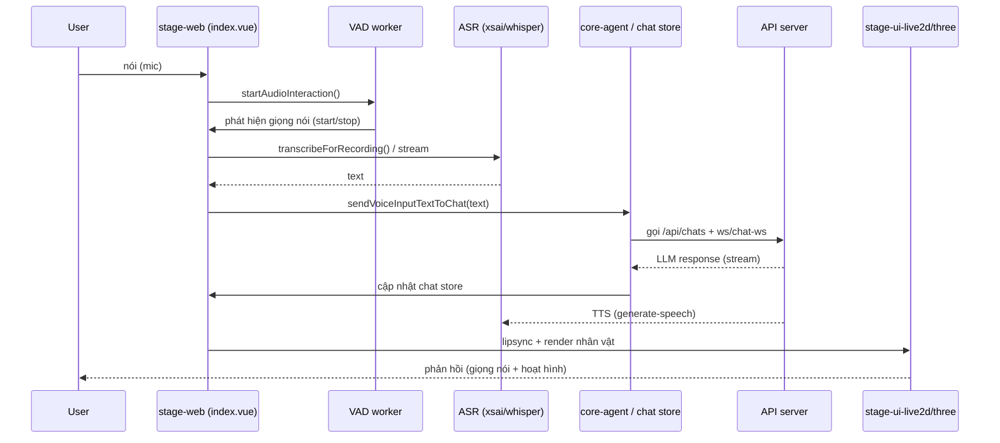

# Tài liệu ứng dụng gốc stage-web

Tài liệu này tập trung chi tiết vào **`resources/js/projects/stage-web`** — ứng dụng gốc của **Suri VTube** (tên gốc **AIRI**). Khác với tài liệu tổng quan, file này đi sâu vào **từng package được sử dụng**, **chúng làm gì** và **mối liên hệ giữa các package**.

---

## 1. stage-web là gì?

`stage-web` là một **SPA (Single Page Application)** thuần Vue 3, là *virtual companion / VTuber* có khả năng:

- Hiển thị nhân vật **Live2D** và **VRM (3D)**.
- Nhận diện giọng nói (VAD) → **transcription** (ASR) → **LLM chat** → **TTS** phản hồi.
- Có đầy đủ auth, settings, onboarding, multi-tab sync, PWA.

Nó **không phụ thuộc Laravel/Inertia** — nó là một app độc lập, được CV project nhúng qua iframe (route `/projects/suri-v-tube`). Toàn bộ logic được chia nhỏ thành các **workspace packages** (từ `@dtrensuri/*`) trong monorepo.

---

## 2. Entry point & cách app khởi động

### `src/main.ts` (đầu vào)

```text
createPinia() ──► setupSynced() (đồng bộ multi-tab) + piniaPluginTracing (dev)
createRouter() ──► setupLayouts(routes) + web/hash history theo env
createApp(App)
  .use(synced.vue)        // electron/shared sync
  .use(MotionPlugin)      // @vueuse/motion
  .use(autoAnimatePlugin) // @formkit/auto-animate
  .use(router)            // vue-router
  .use(pinia)             // state
  .use(PiniaColada)       // data fetching / cache
  .use(i18n)              // vue-i18n (+ @dtrensuri/i18n locales)
  .use(Tres)              // @tresjs/core (Three.js)
  .use(trackButtonPlugin) // @dtrensuri/stage-ui/directives
  .mount('#app')
```

### `src/App.vue` (root)

- Setup **auth** (onAuthenticated/onLogout), **onboarding**, **chat**, **display models**.
- Khởi tạo các **module** (hearing, speech, vision, consciousness, artistry).
- Hiển thị **StageTransitionGroup**, **ErrorBoundary**, **Toaster**, **PerformanceOverlay**.
- Preload các model inference nền (`useInferencePreload`).

### `src/pages/index.vue` (trang chính/`stage scene`)

- VAD + transcription pipeline (khởi/xử lý giọng nói).
- `WidgetStage` render Live2D/VRM, orbit controls, cursor tracking.

### Các thư mục khác

- `src/modules/` — `i18n.ts`, `pwa.ts`.
- `src/workers/vad/` — VAD worker (manager + WASM).
- `src/stores/` — Pinia stores cục bộ (background, pwa, devtools-lag).
- `src/pages/*` — index, auth, settings, devtools.

---

## 3. Chi tiết các workspace packages được dùng

### 3.1 Package UI / Layout (giao diện)

| Package | Tên | Chức năng |
| -------- | ---- | --------- |
| `@dtrensuri/ui` | Airtable UI components | Bộ component UI dùng chung (Button, Input, Dialog...), `useTheme`, `ErrorBoundary` |
| `@dtrensuri/ui-transitions` | Transition animations | Bộ hiệu ứng chuyển trang (ví dụ `StageTransitionGroup` dùng `bubble-wave-out`) |
| `@dtrensuri/stage-layouts` | Shared Layouts | Layout dùng chung: `Header`, `InteractiveArea`, `MobileHeader`, `MobileInteractiveArea`, `BackgroundProvider`, `AdaptiveInput`, `ViewControls`, `Widgets` |
| `@dtrensuri/stage-pages` | Shared Pages | Các page dùng chung (settings, model...), đóng góp route cho auto-router |
| `@dtrensuri/stage-ui` | Shared core for stage | **Package lớn nhất**: stores, composables, components, workers/vad, libs (auth, analytics, pinia, providers, inference), directives |

### 3.2 Package Model Driver (render nhân vật)

| Package | Tên | Chức năng |
| -------- | ---- | --------- |
| `@dtrensuri/stage-ui-live2d` | Live2D render | Render + quản lý model Live2D (Cubism SDK) |
| `@dtrensuri/stage-ui-three` | Three.js/VRM render | Render model 3D VRM qua `@tresjs` |
| `@dtrensuri/stage-ui-mmd` | MMD stage | Hỗ trợ model MikuMikuDance |
| `@dtrensuri/stage-ui-spine` | Spine render | Render sprite Spine |
| `@dtrensuri/stage-ui-tachie` | Tachie (立ち絵) | Render ảnh lập thể / tachie |
| `@dtrensuri/model-driver-mediapipe` | MediaPipe mocap | Bắt chuyển động cơ thể (pose) từ camera |
| `@dtrensuri/model-driver-lipsync` | Lipsync driver | Đồng bộ môi (lipsync) theo audio |
| `@dtrensuri/model-driver-magic-live2d` | Live2D magic driver | Điều khiển Live2D bằng motion/magic |
| `@dtrensuri/motion-driver-magic` | Magic motion driver | Điều khiển chuyển động bằng keyframe/magic |

### 3.3 Package Audio / Speech / AI

| Package | Tên | Chức năng |
| -------- | ---- | --------- |
| `@dtrensuri/audio` | Audio processing | Tiện ích xử lý âm thanh (encoding wav, recorder...) |
| `@dtrensuri/pipelines-audio` | Audio pipeline | Dàn âm thanh: capture → VAD → encode → stream, TTS chunking |
| `@dtrensuri/core-agent` | Core agent runtime | Vòng điều phối agent: chat orchestration, context registry, response categoriser, llm-marker-parser |
| `@dtrensuri/core-character` | Core character pipeline | Pipeline nhân vật: segmentation, emotion, delay, TTS tuỳ chọn |
| `@dtrensuri/i18n` | i18n locales | Bộ locale đa ngôn ngữ (en/ja/vi...) dùng cho `vue-i18n` |
| `@dtrensuri/server-sdk` | Server client SDK | SDK client kết nối tới API server (Hono) |

### 3.4 Package Tiện ích (utility)

| Package | Tên | Chức năng |
| -------- | ---- | --------- |
| `@dtrensuri/stage-shared` | Shared | Hằng số & tiện ích dùng chung: `isEnvTruthy`, analytics/posthog, auth, beat-sync, io-trace |
| `@dtrensuri/stream-kit` | Stream utils | Stream utilities (queues, streams) |
| `@dtrensuri/ccc` | Code/Config Core | Định nghĩa card/cấu hình dùng trong nhiều nơi |
| `@dtrensuri/better-ws` | Better WebSocket | WebSocket helper (crossws) |
| `@dtrensuri/input-gamepad` | Gamepad input | Hỗ trợ input gamepad |
| `@dtrensuri/electron-screen-capture` | Electron capture | Chụp màn hình trong Electron |
| `@dtrensuri/font-*` | Fonts | Font hiển thị (chillroundm, cjkfonts-allseto, xiaolai) |
| `@dtrensuri/plugin-protocol` | Plugin protocol | Giao thức plugin/host |
| `@dtrensuri/server-sdk-shared` / `server-shared` | Shared server | Kiểu dữ liệu chia sẻ giữa server & client |

> **Lưu ý:** stage-web chỉ **dùng trực tiếp** một phần các package trên (xem `package.json` dependencies). Một số package như `better-ws`, `input-gamepad`, `electron-screen-capture`, `electron` chỉ dùng trong các app khác (desktop, server) nhưng vẫn nằm cùng monorepo.

---

## 4. Các thư viện npm cốt lõi (dependencies trực tiếp)

### 4.1 Vue & Ecosystem

| Thư viện | Vai trò |
| -------- | ------- |
| **vue** | Framework |
| **vue-router** | Routing (auto-routes qua plugin) |
| **pinia** + **@pinia/colada** | State + data fetching/cache |
| **vue-i18n** | i18n (dùng locale từ `@dtrensuri/i18n`) |
| **@vueuse/core** | Composables utilities |
| **@vueuse/motion** | Animation motion |

### 4.2 UI

| Thư viện | Vai trò |
| -------- | ------- |
| **reka-ui** | UI primitives (headless, unovue) |
| **vaul-vue** | Drawer/dialog |
| **embla-carousel-vue** | Carousel |
| **vue-sonner** | Toast |
| **splitpanes** | Split panes (resizable layout) |
| **@formkit/auto-animate** | Auto animations |
| **animejs** | JS animations |
| **driver.js** | Product tour |

### 4.3 3D / Live2D

| Thư viện | Vai trò |
| -------- | ------- |
| **three** | 3D engine |
| **@tresjs/core** + **@tresjs/cientos** | Vue wrapper cho Three.js |
| **@dtrensuri/model-driver-mediapipe** | MediaPipe pose |
| **@dtrensuri/stage-ui-live2d** | Live2D |

### 4.4 AI / ML / Audio

| Thư viện | Vai trò |
| -------- | ------- |
| **@xsai/generate-text** / **stream-text** / **generate-speech** | LLM text/gen + speech generation |
| **@xsai/stream-transcription** / **stream-transcription** | Streaming ASR |
| **onnxruntime-web** | Chạy model ONNX trong browser |
| **@huggingface/transformers** | Transformers inference (whisper, embeddings) |
| **@dtrensuri/pipelines-audio** | Audio pipeline |
| **@dtrensuri/audio** | Audio utils |
| **unspeech** | Text-to-speech |
| **audio-vad / silero-vad** | Voice Activity Detection (WASM) |

### 4.5 Markdown & Content

| Thư viện | Vai trò |
| -------- | ------- |
| **remark-parse / remark-rehype / rehype-stringify / unified** | Markdown pipeline |
| **shiki** | Syntax highlight |
| **dompurify** | XSS sanitize |

### 4.6 Validate & Data

| Thư viện | Vai trò |
| -------- | ------- |
| **valibot** / **zod** | Schema validation |
| **@pinia/colada** | Cache/query |
| **localforage** | IndexedDB wrapper |
| **drizzle-orm** | ORM (client) |
| **es-toolkit** | Utility functions |

### 4.7 Khác

| Thư viện | Vai trò |
| -------- | ------- |
| **hono** | API client / server endpoint |
| **nprogress** | Progress bar |
| **colorjs.io / culori / node-vibrant** | Màu sắc |
| **jszip / yauzl** | ZIP (model archive) |
| **html2canvas** | DOM → image |
| **posthog-js** | Analytics |
| **web-haptics** | Haptics |
| **workbox-window** | PWA |

---

## 5. Mối liên hệ giữa các package (bản đồ phụ thuộc)

```mermaid
flowchart TD
    WEB[stage-web (app)] --> UI[@dtrensuri/stage-ui]
    WEB --> LAY[@dtrensuri/stage-layouts]
    WEB --> PAGES[@dtrensuri/stage-pages]
    WEB --> SHRD[@dtrensuri/stage-shared]
    WEB --> I18N[@dtrensuri/i18n]
    WEB --> AUDIO[@dtrensuri/audio]
    WEB --> PIPES[@dtrensuri/pipelines-audio]
    WEB --> AGENT[@dtrensuri/core-agent]
    WEB --> CHAR[@dtrensuri/core-character]
    WEB --> SSDK[@dtrensuri/server-sdk]
    WEB --> SUI_L2D[@dtrensuri/stage-ui-live2d]
    WEB --> SUI3D[@dtrensuri/stage-ui-three]
    WEB --> MPM[@dtrensuri/model-driver-mediapipe]
    WEB --> MP[@dtrensuri/ui]
    WEB --> MPT[@dtrensuri/ui-transitions]

    UI --> SHRD
    UI --> I18N
    LAY --> UI
    LAY --> SHRD
    PIPES --> AUDIO
    CHAR --> AGENT
    AGENT --> SSDK
    SSDK --> SHRD
    SUI_L2D --> UI
    SUI3D --> UI
    MPM --> SHRD
```

### Giải thích luồng phụ thuộc chính

1. **`stage-web` (app)** là nơi lắp ráp mọi thứ lại — nó phụ thuộc hầu hết các package.
2. **`@dtrensuri/stage-ui`** là package "trái tim" — chứa hầu hết stores/composables/components dùng chung. Nó phụ thuộc `stage-shared`, `i18n`.
3. **`@dtrensuri/stage-layouts`** cung cấp layout (Header, Background) và **phụ thuộc `stage-ui`** và `stage-shared`.
4. **`@dtrensuri/stage-pages`** cung cấp page dùng chung; được **auto-router** gộp route với `src/pages` của stage-web.
5. **`@dtrensuri/core-agent`** xử lý logic agent (LLM orchestration) — là "não" — và **phụ thuộc `server-sdk`** để gọi API.
6. **`@dtrensuri/pipelines-audio`** xử lý audio pipeline và **phụ thuộc `@dtrensuri/audio`**.
7. **`@dtrensuri/stage-ui-live2d`** / **`stage-ui-three`** render nhân vật; phụ thuộc `stage-ui` (stores/settings).
8. **`stage-shared`** nằm ở **tầng dưới cùng** — hầu hết package đều dùng nó cho hằng số/type chung.

---

## 6. Luồng dữ liệu end-to-end (giọng nói → phản hồi)



---

## 7. Điểm quan trọng khi làm việc với stage-web

- **Không xung đột với Inertia**: stage-web mount độc lập (có `#app` riêng), không dùng Inertia. CV project chỉ nhúng qua iframe.
- **Multi-tab sync**: `setupSynced()` trong `main.ts` đồng bộ pinia state giữa nhiều tab/electron.
- **Router**: `vue-router/auto-routes` tự sinh route từ `src/pages/**` + `stage-pages/src/pages/**`; layout qua `virtual:generated-layouts`.
- **Streaming providers**: nếu provider dùng streaming (`shouldUseStreamInput`), transcription do pipeline tự xử lý; ngược lại stage-web gọi `startRecord/stopRecord` thủ công.
- **PWA**: đăng ký service worker qua `virtual:pwa-register` (vite-plugin-pwa); có thể gây cache nếu đã từng deploy trước.
- **Assets**: Live2D/VRM model được tải về lúc build (unplugin / DownloadLive2DSDK) từ `public/assets`.

---

Tài liệu này chỉ bao quát **ứng dụng stage-web** và các **package nó sử dụng**. Để xem tổng quan toàn CV project (route, Laravel, Inertia), xem `docs/suri-v-tube.md`.
