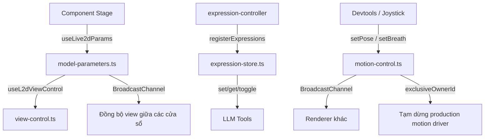

# Stores của `stage-ui-live2d`

Thư mục này chứa các **Pinia store** quản lý toàn bộ trạng thái của mô hình Live2D trên sân khấu (stage). Mỗi store đảm nhận một nhóm trách nhiệm riêng, và chúng phối hợp với nhau qua **BroadcastChannel** để đồng bộ giữa nhiều cửa sổ (renderer window).

```
src/stores/
├── index.ts            # Barrel export – re-export tất cả store
├── expression-store.ts # Biểu cảm (expression) + tham số + LLM exposure
├── model-parameters.ts # Tham số mô hình + motion hiện tại + view control
├── motion-control.ts   # Điều khiển chuyển động thủ công (joystick/breath)
└── view-control.ts     # Vị trí / scale / hiển thị control trên stage
```

---

## 1. `index.ts` — Barrel export

File này chỉ đơn giản re-export tất cả các store để bên ngoài import gọn gàng:

```ts
export * from './expression-store'
export * from './model-parameters'
export * from './motion-control'
export * from './view-control'
```

---

## 2. `expression-store.ts` — Store biểu cảm (`useExpressionStore`)

**ID:** `live2d-expressions`

### Vai trò
Quản lý **biểu cảm (expression)** và **tham số (parameter)** của mô hình Live2D, đồng thời cung cấp giao diện cho **LLM** thao tác (set / get / toggle).

### State chính
| State | Kiểu | Ý nghĩa |
|-------|------|---------|
| `expressions` | `Map<string, ExpressionEntry>` | Bản đồ tên → entry tham số |
| `modelId` | `string` | ID mô hình đang tải (dùng để phạm vi hóa persistence) |
| `expressionGroups` | `Map<string, ExpressionGroupDefinition>` | Các nhóm biểu cảm parse từ `model3.json` / `exp3.json` |
| `llmMode` | `'all' \| 'none' \| 'custom'` | Chế độ phơi bày cho LLM |
| `llmExposed` | `Map<string, boolean>` | Cờ phơi bày theo từng nhóm (chỉ dùng khi `custom`) |

### Cấu trúc dữ liệu chính
- **`ExpressionEntry`**: một tham số đơn lẻ, gồm `name`, `parameterId`, `blend` (`Add`/`Multiply`/`Overwrite`), `currentValue` (giá trị runtime), `defaultValue` (mặc định cấp ứng dụng), `modelDefault` (mặc định gốc từ moc3/exp3), `targetValue` (giá trị đích khi toggle), và `resetTimer` (timer auto-reset).
- **`ExpressionGroupDefinition`**: một nhóm biểu cảm (vd `"Cry"`) chứa nhiều tham số — mỗi tham số có `parameterId`, `blend`, `value`.

### Cơ chế hoạt động

**1. Đăng ký (`registerExpressions`)**
- Được gọi bởi `expression-controller` sau khi parse exp3.
- Xóa timer cũ, reset toàn bộ state, lưu `modelId`.
- Đăng ký các nhóm và các entry tham số.
- **Khôi phục defaults đã lưu** từ `localStorage` (key `expression-defaults:<modelId>`).

**2. Phân giải tên (`resolve`)**
- Trả về `'group'` nếu tên khớp nhóm biểu cảm, `'param'` nếu khớp tham số trực tiếp, hoặc `null`.

**3. Set / Get / Toggle**
- **`set(name, value, duration?)`**: gán giá trị cho nhóm (áp lên từng tham số con) hoặc tham số trực tiếp. Hỗ trợ `boolean` → `1/0`. Nếu `duration > 0`, lên lịch **auto-reset** về `defaultValue` sau `duration` giây.
- **`get(name?)`**: trả về trạng thái của một hoặc tất cả entry dưới dạng `ExpressionState` (serialisable để gửi cho LLM).
- **`toggle(name, duration?)`**: lật giữa trạng thái active và default.
  - Với **group**: active khi có ít nhất một tham số non-zero đang bằng giá trị exp3. Khi toggle, tham số non-zero được set về `modelDefault` (nếu đang active) hoặc về `param.value` (nếu chưa active); tham số zero là "lệnh reset".
  - Với **param**: lật giữa `modelDefault` và `targetValue`.

**4. Persistence**
- `saveDefaults()`: lưu `currentValue` hiện tại thành `defaultValue` và ghi vào `localStorage`.
- `resetAll()`: đưa mọi entry về `modelDefault`.
- `dispose()`: dọn dẹp toàn bộ khi unload model.

**5. LLM exposure**
- `setLlmMode` / `setLlmExposed` / `isExposedToLlm`: kiểm soát nhóm nào được phơi bày cho công cụ LLM (`all` / `none` / `custom`).

**6. `applyValue` (private)**
- Hủy timer cũ, gán `currentValue`, và nếu `duration > 0` thì tạo `setTimeout` để tự reset về `defaultValue`.

---

## 3. `model-parameters.ts` — Store tham số mô hình (`useLive2dParams`)

**ID:** `live2d`

### Vai trò
Store "tổng hợp" quản lý **tham số mô hình** (mắt, miệng, lông mày, góc đầu...), **motion hiện tại**, và **view control** (vị trí/scale). Đây là store chính mà các component stage dùng.

### Cơ chế hoạt động

**1. BroadcastChannel đồng bộ view**
- Tạo channel `airi-stores-stage-ui-live2d`.
- `shouldUpdateView()`: post sự kiện `live2d-should-update-view` lên channel **và** gọi trực tiếp các hook cục bộ.
- `onShouldUpdateView(hook)`: đăng ký hook; trả về hàm hủy đăng ký.
- `watch(data)`: khi nhận sự kiện từ channel (cửa sổ khác), gọi tất cả hook cục bộ → **đồng bộ view giữa nhiều cửa sổ**.

**2. State dùng `useLocalStorageManualReset`**
- `currentMotion`: `{ group, index }` — motion đang phát (mặc định `Idle`).
- `availableMotions`: danh sách motion khả dụng.
- `motionMap`: ánh xạ tên motion → file.
- `modelParameters`: `Record<string, number>` — các tham số Live2D, mặc định là `defaultModelParameters` (góc, mắt, miệng, lông mày, thở...).
- Tất cả đều **persist vào localStorage** và có khả năng `reset()`.

**3. View control**
- Lấy `position`, `scale`, `set` từ `useL2dViewControl()`.

**4. `resetState()`**
- Reset mọi view control về default, reset motion/parameters, rồi gọi `shouldUpdateView()` để thông báo cho các cửa sổ khác.

---

## 4. `motion-control.ts` — Store điều khiển chuyển động (`useLive2DMotionControl`)

**ID:** `live2d-motion-control`

### Vai trò
Chia sẻ **chuyển động thủ công tạm thời** (joystick) và **điều khiển độc quyền** giữa các cửa sổ renderer. Dùng channel trực tiếp vì joystick cập nhật tần suất cao và mang tính tạm thời.

### State chính
- `control`: `{ active, ownerId, pose, dynamics }` — pose mục tiêu + cài đặt spring (`follow`, `inertia`).
- `breathControl`: `{ active, ownerId, startedAtMs, options }` — điều khiển hơi thở thủ công.
- `exclusiveOwnerId`: ai đang giữ quyền điều khiển độc quyền.

### Cơ chế hoạt động

**1. Sự kiện BroadcastChannel**
Các sự kiện: `set` / `release` (motion), `set` / `release` (breath), `claim-exclusive` / `release-exclusive`.

**2. `applyEvent` — xử lý sự kiện**
- **Set motion**: ghi đè `control` với pose/dynamics đã **normalize** (clamp về khoảng hợp lệ).
- **Release motion**: chỉ xóa nếu `ownerId` khớp — **cửa sổ cũ không thể release controller mới hơn**.
- **Set/release breath**: tương tự, có `startedAtMs` làm gốc pha.
- **Claim exclusive**: gán `exclusiveOwnerId`; **release exclusive** chỉ xóa nếu đúng owner.

**3. API công khai**
- `setPose(ownerId, pose, dynamics)`: áp dụng cục bộ + `post` lên channel.
- `release(ownerId)`, `setBreath(...)`, `releaseBreath(...)`: tương tự.
- `claimExclusiveControl(ownerId)`: nếu channel chưa sẵn sàng, chờ `nextTick` rồi post.
- `releaseExclusiveControl(ownerId)`.

**4. Hàm thuần (pure functions)**
- `normalizePose` / `normalizeDynamics` / `normalizeBreathOptions`: clamp giá trị về khoảng hợp lệ.
- `sampleLive2DBreath(options, elapsedSeconds)`: lấy mẫu đường cong thở — dùng **half-cosine** cho inhale và exhale, giữ `minimum` ở đoạn dwell. Trả về `{ phase, stage, value }`.
- `getLive2DMotionControlModelOffset(control)`: ánh xạ joystick (trục Y hướng lên) sang vị trí Pixi (trục Y hướng xuống).

---

## 5. `view-control.ts` — View control (`useL2dViewControl`)

### Vai trò
Quản lý **vị trí / scale** của mô hình trên stage và trạng thái hiển thị của các control element (slider).

### State
- `viewControlsEnabled`: bật/tắt hiển thị control element.
- `viewControlMode`: control nào đang được điều khiển (`'x' | 'y' | 'scale'`).
- `position`: `{ x, y }` — vị trí mô hình (persist qua `useLocalStorage`, key `settings/live2d/position`).
- `scale`: hệ số scale (persist, key `settings/live2d/scale`).

### Cấu hình
- `defaultControlConfig`: min/max/step/default/buttonText cho từng control (`x`, `y`, `scale`).
- `formatter`: hàm định dạng hiển thị giá trị (phần trăm).

### Cơ chế hoạt động
- `set(key, value?)`: gán giá trị cho control, **clamp** trong khoảng `[min, max]`; nếu không truyền `value` thì reset về default.
- Trả về `position`, `scale`, `set`, `viewControlsEnabled`, `viewControlMode`.

---

## Tổng kết — Luồng phối hợp giữa các store



**Tóm tắt trách nhiệm:**
- `expression-store` → biểu cảm & tham số + giao diện LLM.
- `model-parameters` → tham số mô hình, motion hiện tại, view control, đồng bộ view.
- `motion-control` → chuyển động thủ công tạm thời + điều khiển độc quyền.
- `view-control` → vị trí/scale + hiển thị control element.

Tất cả đều là **Pinia setup store** (dùng `defineStore` với hàm setup), tận dụng **BroadcastChannel** (`@vueuse/core`) để đồng bộ đa cửa sổ và **localStorage** để persist cài đặt.
