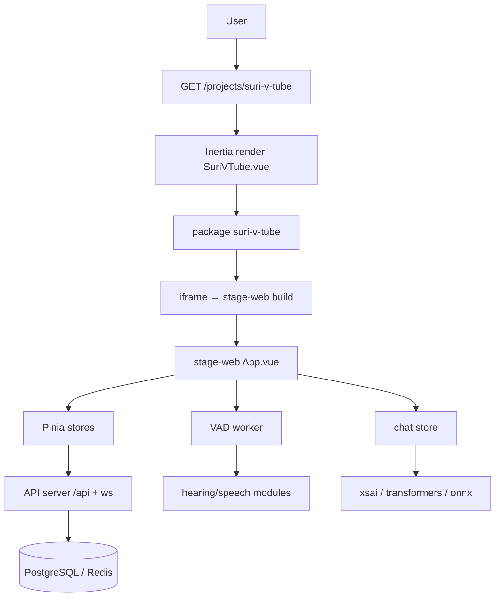

# Suri VTube — Tài liệu kỹ thuật

Project **Suri VTube** (tên gốc **stage-web / AIRI**) là một virtual companion hiện được tích hợp vào CV project. Tài liệu này giải thích cấu trúc mã nguồn, các thư viện cốt lõi, chức năng, API endpoints và công nghệ đang sử dụng.

---

## 1. Tổng quan kiến trúc

```text
CV Project (Laravel + Inertia)
│
├── routes/web.php  ──►  Route::inertia('/projects/suri-v-tube', 'Projects/SuriVTube')
│
└── resources/js/
    ├── pages/Projects/SuriVTube.vue   ← Inertia page
    ├── projects/suri-v-tube/          ← Package @dtrensuri/suri-v-tube (iframe wrapper)
    │   └── src/SuriVTube.vue          ← Component bọc iframe
    └── projects/stage-web/            ← Ứng dụng gốc (standalone app)
        ├── src/main.ts                ← Entry point
        ├── src/App.vue                ← Root component
        ├── src/pages/                 ← Router pages (index, auth, settings, devtools)
        ├── src/stores/                ← Pinia stores (background, pwa, devtools-lag)
        ├── src/workers/vad/           ← Voice Activity Detection workers
        └── src/modules/               ← i18n, pwa modules

server/                                ← Backend
├── apps/api/                          ← API server (Hono + PostgreSQL + Drizzle)
└── apps/auth/                         ← Authentication server
```

### Cách hoạt động

- Người dùng truy cập route `/projects/suri-v-tube` → Inertia trả về `SuriVTube.vue`.
- `SuriVTube.vue` import component `SuriVTube` từ package `@dtrensuri/suri-v-tube`.
- Component này render một **`<iframe>`** trỏ đến build của ứng dụng `stage-web` (mặc định `${origin}/suri-v-tube-app/`).

> **Lưu ý:** `stage-web` là một ứng dụng độc lập (có router, pinia, i18n, PWA, worker riêng) nên được nhúng qua iframe thay vì mount trực tiếp để tránh xung đột với Inertia app.

---

## 2. Các file & thư mục chính

### 2.1 `resources/js/projects/suri-v-tube/` (wrapper package)

| File                   | Chức năng                                                                  |
| ---------------------- | -------------------------------------------------------------------------- |
| `package.json`         | Khai báo package `@dtrensuri/suri-v-tube`                                  |
| `src/index.ts`         | Re-export component `SuriVTube`                                            |
| `src/SuriVTube.vue`    | Component Vue: nhúng stage-web qua iframe, nhận prop `src` (URL) và `height` |

**Alias mapping** (trong `vite.config.ts` & `tsconfig.json`):

```text
@dtrensuri/suri-v-tube  →  resources/js/projects/suri-v-tube
```

### 2.2 `resources/js/projects/stage-web/` (ứng dụng gốc)

| File                              | Chức năng                                                                                                |
| --------------------------------- | -------------------------------------------------------------------------------------------------------- |
| `src/main.ts`                     | Entry point: tạo app, router, pinia, i18n, các plugin (TresJS, AutoAnimate, Motion, PiniaColada, trackButton) |
| `src/App.vue`                     | Root component: setup auth, onboarding, chat, display models, các module (hearing, speech, vision, consciousness...), ErrorBoundary, Toaster, PerformanceOverlay |
| `src/pages/index.vue`             | Trang chính (stage): Live2D/VRM model, widget stage, interactive area, VAD + transcription pipeline      |
| `src/pages/auth/`                 | Trang đăng nhập (với `RouterView`)                                                                       |
| `src/pages/settings/`             | Settings: `account/`, `characters/`, `system/`                                                            |
| `src/pages/devtools/`             | Công cụ dev: audio-record, background-gradient, gesture-circle, model-driver-mediapipe, performance-visualizer, web-haptics... |
| `src/stores/`                     | Pinia stores cục bộ: `background.ts`, `pwa.ts`, `devtools-lag.ts`                                         |
| `src/modules/`                    | `i18n.ts`, `pwa.ts`                                                                                      |
| `src/workers/vad/`                | AudioWorklet + WASM cho Voice Activity Detection                                                          |
| `src/components/`                 | AudioWaveform, IconAnimation, DataGui, Devtools/PerformanceOverlay                                        |

---

## 3. Các thư viện cốt lõi

### Frontend

| Thư viện                                       | Vai trò                                  |
| ---------------------------------------------- | ---------------------------------------- |
| **Vue 3** + **TypeScript**                     | Framework chính                          |
| **vue-router**                                 | Routing (auto-routes qua `vue-router/vite`) |
| **Pinia** (+ `@pinia/colada`)                  | State management + data fetching          |
| **vue-i18n**                                   | Đa ngôn ngữ                              |
| **UnoCSS**                                     | Utility-first CSS (thay cho Tailwind)     |
| **@tresjs/core** & **@tresjs/cientos**         | Three.js wrapper (render 3D / VRM)        |
| **vue-sonner**                                 | Toast notifications                      |
| **vaul-vue / reka-ui / embla-carousel-vue**    | UI primitives (dialog, carousel)          |
| **@vueuse/core**                               | Vue composables utilities                 |
| **@formkit/auto-animate**                      | Auto animations                          |

### AI / ML

| Thư viện                                                   | Vai trò                                            |
| ---------------------------------------------------------- | -------------------------------------------------- |
| **@xsai/generate-text / stream-text / generate-speech**    | LLM inference (text + speech)                      |
| **@huggingface/transformers**                              | Transformers model inference (whisper, embeddings)  |
| **onnxruntime-web**                                        | ONNX runtime (chạy model trong browser)            |
| **audio-vad / silero VAD**                                 | Voice Activity Detection (WASM)                    |
| **@proj-airi/pipelines-audio**                             | Audio pipelines (ASR, TTS chunking)                |
| **@xsai-stream-transcription**                             | Streaming transcription                            |
| **@proj-airi/model-driver-mediapipe**                      | MediaPipe mocap                                    |

### Multimedia

| Thư viện                                       | Vai trò                               |
| ---------------------------------------------- | ------------------------------------- |
| **three**                                      | 3D rendering                         |
| **Cubism SDK (Live2D)**                        | Live2D model rendering                |
| **animejs**                                    | Animations                           |
| **html2canvas**                                | DOM to canvas                        |
| **jszip / yauzl**                              | ZIP processing (model archives)      |
| **node-vibrant / colorjs.io / culori**         | Color analysis & manipulation        |
| **d3**                                         | Data visualization (charts)          |
| **web-haptics**                                | Haptic feedback                      |

### Markdown / Content

| Thư viện                                                       | Vai trò             |
| -------------------------------------------------------------- | ------------------- |
| **remark-parse / remark-rehype / rehype-stringify / unified**  | Markdown pipeline   |
| **shiki**                                                      | Syntax highlighting |
| **dompurify**                                                  | XSS sanitization    |

### Validate / Schema

| Thư viện        | Vai trò                     |
| --------------- | --------------------------- |
| **valibot**     | Runtime schema validation   |
| **zod**         | Schema validation           |
| **xsschema**    | XSS schema                  |

### Database / Cache (frontend)

| Thư viện            | Vai trò                    |
| ------------------- | -------------------------- |
| **localforage**     | Local storage (IndexedDB wrapper) |
| **drizzle-orm**     | ORM (client-side queries)  |
| **@pinia/colada**   | Cache & data fetching      |

### Backend

| Thư viện                        | Vai trò                    |
| ------------------------------- | -------------------------- |
| **Hono**                        | Web framework (API server) |
| **PostgreSQL + pg**             | Database                   |
| **Drizzle ORM**                 | Database schema/migration  |
| **@electric-sql/pglite**        | WASM PostgreSQL (edge)     |
| **ioredis**                     | Redis client               |
| **better-auth**                 | Authentication             |
| **jose**                        | JWT handling               |
| **OpenTelemetry**               | Tracing & metrics          |
| **PostHog**                     | Analytics                  |
| **valibot / drizzle-valibot**   | Validation                 |

---

## 4. Chức năng chính (các function/feature)

### 4.1 Entry point (`main.ts`)

- Tạo **Pinia** với `setupSynced()` để đồng bộ state giữa các tab.
- Tạo **router** (hash history nếu target HuggingFace Space, còn lại web history).
- Cài đặt các plugin: `MotionPlugin`, `autoAnimatePlugin`, `PiniaColada`, `i18n`, `Tres`, `trackButtonPlugin`.
- Cấu hình **analytics adapter (PostHog)** và **auth handler**.
- Dev-only: capture events trên `__vue-devtools-container__`.

### 4.2 Root component (`App.vue`)

- **Auth flow**: `onAuthenticated`, `onLogout`, `registerAuthenticatedSetup`.
- **Onboarding**: hiện `OnboardingDialog` khi cần, xử lý `configured` / `skipped`.
- **Modules**: `useHearingStore`, `useSpeechStore`, `useVisionStore`, `useConsciousnessStore`, `useArtistryStore`, `useSettingsStageModel`.
- **Initialization** (`onMounted`): initialize analytics, auth, display models, card, chat, server channel, context bridge, character orchestrator, load display models từ IndexedDB, preload inference models.
- **Theme**: tính toán primary/secondary/tertiary colors dựa trên `isDark` và `--chromatic-hue`, dynamic hue support.
- **Cleanup** (`onUnmounted`): dispose chat, context bridge, stop setup handlers.

### 4.3 Trang chính (`pages/index.vue`) — Stage scene

- **BackgroundProvider**: nền động, đồng bộ theme color.
- **WidgetStage**: hiển thị Live2D / VRM model; hỗ trợ orbit controls (desktop) và cursor tracking.
- **VAD + Transcription pipeline**:
  - `startAudioInteraction()`: khởi động audio recorder, VAD, streaming transcription.
  - `handleSpeechStart/End/Cancel()`: xử lý bắt đầu/kết thúc giọng nói (streaming vs non-streaming providers).
  - `transcribeForRecording()`: transcription không streaming.
  - `sendVoiceInputTextToChat()`: gửi text vào chat.
  - `stopAudioInteraction()`: dọn dẹp VAD, transcription consumers.
- **Responsive**: `isMobile` breakpoints; stage surface dùng `position: fixed` để tránh lỗi Safari input pan.
- **Header**: `Header` (desktop) / `MobileHeader` (mobile).
- **HoloCoupon**: widget overlay.

### 4.4 Devtools pages (công cụ phát triển)

- `audio-record.vue` — thử nghiệm ghi âm.
- `background-gradient-blending.vue` — hiệu ứng gradient nền.
- `gesture-circle.vue` — cử chỉ.
- `model-driver-mediapipe.vue` — MediaPipe motion capture.
- `performance-playground.vue` & `performance-visualizer.vue` — benchmarks.
- `web-haptics.vue` — haptics.
- `use-magic-keys.vue` — magic keys.

---

## 5. API Endpoints (backend)

### 5.1 `server/apps/api` (API server — Hono)

| Route                              | Chức năng                               |
| ---------------------------------- | --------------------------------------- |
| `/api/chats`                       | CRUD chat sessions                      |
| `/api/characters`                  | Quản lý characters                      |
| `/api/providers`                   | LLM providers                           |
| `/api/openai`                      | OpenAI-compatible endpoints (proxy)     |
| `/api/flux`                        | Flux image generation                   |
| `/api/stripe`                      | Billing / payments (Stripe webhook)     |
| `/api/voice-packs`                 | Voice packs                             |
| `/ws/chat-ws`                      | WebSocket chat (streaming)              |
| `/ws/audio-speech-ws`              | WebSocket speech (TTS/STT)              |
| `/api/audio-transcription-stream`  | Streaming transcription                 |
| `/internal-auth`                   | Internal authentication                 |
| `/v2`                              | Chat v2 API (từ `server-sdk-shared`)    |

### 5.2 `server/apps/auth` (Auth server)

| Route                                 | Chức năng                          |
| ------------------------------------- | ---------------------------------- |
| `/auth`                               | UI login base path                 |
| `/api/userinfo`                       | User info                          |
| `/v1/resource-api`                    | Resource API (protected)           |
| providers: `google`, `github`, `steam` | OAuth social authorization        |

---

## 6. Store modules (state management)

Các store nằm trong package `@proj-airi/stage-ui/stores`:

| Store                        | Chức năng                              |
| ---------------------------- | -------------------------------------- |
| `auth`                       | Authentication state                   |
| `chat`                       | Chat state, streaming messages         |
| `character`                  | Character data & selection             |
| `display-models`             | Display models (Live2D, VRM)           |
| `settings`                   | Settings, audio device                 |
| `onboarding`                 | First-time setup                       |
| `modules/hearing`            | Audio input pipeline                   |
| `modules/speech`             | TTS speech output                      |
| `modules/vision`             | Vision (image understanding)           |
| `modules/consciousness`      | Autonomous behavior                    |
| `modules/artistry`           | Art/content generation                 |
| `modules/web-search`         | Web search                             |
| `modules/gaming-*`           | Gaming (Minecraft, Factorio)           |
| `mods/api/*`                 | Mods server channel, context bridge    |

---

## 7. Providers & AI pipelines

- **LLM Provider abstraction** (`stores/providers/`): triển khai các provider (OpenAI, xsai, etc.) qua `@xsai` stack.
- **Streaming vs non-streaming**: main page kiểm tra `shouldUseStreamInput.value` để quyết định transcription dùng streaming (pipeline tự xử lý) hay thủ công (`startRecord/stopRecord`).
- **VAD Worker** (`workers/vad/`): AudioWorklet phát hiện hoạt động giọng nói, hỗ trợ bật/tắt (enable/disable).
- **Inference preload**: `useInferencePreload()` tải trước các model local (Kokoro TTS, whisper...) nền.

---

## 8. Công nghệ đang dùng (stack)

| Lớp                   | Công nghệ                                                       |
| --------------------- | --------------------------------------------------------------- |
| **Backend framework** | Hono (Node.js)                                                  |
| **Database**          | PostgreSQL + Drizzle ORM + PGlite (WASM)                        |
| **Cache/Queue**       | Redis (ioredis)                                                 |
| **Auth**              | better-auth + JWT (jose)                                        |
| **Frontend**          | Vue 3 + TypeScript + Vite                                       |
| **CSS**               | UnoCSS                                                          |
| **3D/Motion**         | Three.js, TresJS, Cubism SDK (Live2D), animejs                  |
| **AI/ML**             | ONNX Runtime Web, Transformers.js, xsai, silero VAD             |
| **Real-time**         | WebSocket (Hono WS + CrossWS)                                   |
| **Observability**     | OpenTelemetry + Langfuse + PostHog                              |
| **PWA**               | vite-plugin-pwa + Workbox                                       |
| **Testing**           | Vitest (các file `*.test.ts` đã bị xóa)                         |

---

## 9. Cách build & chạy

```bash
# Cài dependencies
pnpm install

# Chạy stage-web standalone (dev)
pnpm dev:web

# Build CV app
npm run build   # hoặc pnpm dev (Laravel + Vite)

# Backend
cd server/apps/api && pnpm dev
cd server/apps/auth && pnpm dev
```

---

## 10. Tóm tắt luồng dữ liệu

